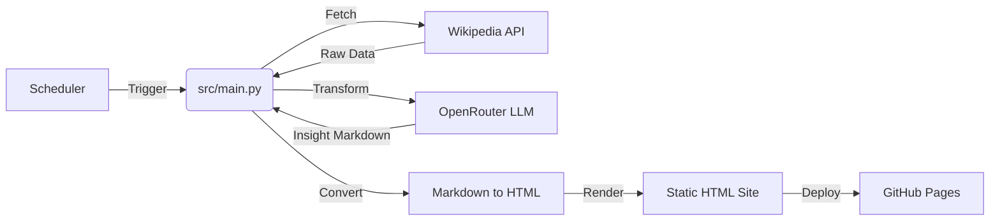

# Architecture Documentation

## 🏗️ System Overview

**Daily Wiki Insights** is an autonomous content generation system designed to run on a scheduled basis (locally via Windows Task Scheduler or cloud-native via GitHub Actions). It transforms raw Wikipedia data into engaging, modern insights using LLMs.

### High-Level Flow



---

## 📂 Project Structure

```
wikipedia-insights/
├── .github/workflows/   # CI/CD pipelines (GitHub Actions)
├── scripts/             # Automation scripts (PowerShell)
├── site/                # Generated static website (HTML/CSS)
├── src/                 # Core application logic (Python)
├── .env                 # Secrets (API Keys) - NOT COMMITTED
├── pyproject.toml       # Dependency management (uv)
└── README.md            # User guide
```

---

## 🧩 Core Components & Libraries

### 1. **Package Management: `uv`**
-   **Why**: Extremely fast Python package installer and resolver. Replaces `pip` and `virtualenv`.
-   **Role**: Manages the project environment and dependencies (`pyproject.toml`).
-   **Key Command**: `uv run src/main.py` (executes script in isolated env).

### 2. **Content Fetcher: `src/scraper.py`**
-   **Library**: `requests`
-   **Why**: Simple, robust HTTP library for API calls.
-   **Role**: Fetches "Today's Featured Article" from the Wikimedia REST API.
-   **Data Flow**: `GET https://api.wikimedia.org/...` -> JSON Response -> Dictionary.

### 3. **Content Transformer: `src/rewriter.py`**
-   **Library**: `requests` (calling OpenRouter API)
-   **Why**: Universal interface for LLMs (Claude, GPT, etc.).
-   **Role**: Sends raw Wikipedia text + Prompt -> LLM -> Returns "Insightful" article in **Markdown**.
-   **Customization**: Change `INSIGHT_PROMPT` in `src/config.py` to alter the writing style.

### 4. **Site Generator: `src/main.py`**
-   **Libraries**: `jinja2`, `markdown`
-   **Why**: 
    -   `jinja2`: Templating engine to separate logic from design.
    -   `markdown`: Converts the rich text returned by the LLM into browser-readable HTML.
-   **Role**: 
    1.  Orchestrates scraping and rewriting.
    2.  Converts Markdown -> HTML.
    3.  Renders `site/template.html`.
-   **Output**: Produces `site/index.html`.

---

## 🔄 Data Flow Detail

1.  **Trigger**: `scripts/run_daily.ps1` wakes up the system.
2.  **Input**: `src/scraper.py` hits Wikipedia.
    *   *Input*: Date (Today)
    *   *Output*: `{ title, extract, thumbnail_url, wiki_url }`
3.  **Processing**: `src/rewriter.py` calls OpenRouter.
    *   *Input*: Raw extract + Prompt
    *   *Output*: Rewritten Markdown text (300-500 words).
4.  **Conversion**: `src/main.py` uses `markdown` library.
    *   *Input*: Markdown string (`**bold**`, `## Heading`)
    *   *Output*: HTML string (`<strong>bold</strong>`, `<h2>Heading</h2>`)
5.  **Rendering**: `src/main.py` loads `site/template.html`.
    *   *Input*: Template + HTML Content
    *   *Output*: Final HTML file.
6.  **Deployment**: Git commands push `site/` folder to GitHub.

---

## 🛠️ Making Quick Changes

### "I want to change the writing style"
*   **File**: `src/config.py`
*   **Action**: Edit `INSIGHT_PROMPT`. You can make it funny, serious, academic, etc.

### "I want to change the website look"
*   **File**: `site/style.css`
*   **Action**: Edit CSS.
    *   `--primary-color`: Headlines & Accents.
    *   `.container`: Adjust `max-width` to change page width.
    *   `.content`: Adjust font size and line height for readability.

### "I want to change the layout structure"
*   **File**: `site/template.html`
*   **Action**: Edit HTML structure. Use Jinja2 tags like `{{ title }}`.
*   **Note**: Use `{{ content | safe }}` to render the HTML properly.

### "I want to run it at a different time"
*   **File**: `scripts/setup_schedule.ps1`
*   **Action**: Change `$Time = "09:00am"`. Run the script again to update the task.

---

## ⚠️ Key Constraints
*   **API Limits**: Wikipedia has rate limits (handled by User-Agent). OpenRouter costs money per token.
*   **Markdown Parsing**: The LLM must return valid Markdown. If it returns malformed text, the HTML conversion might look odd.
*   **Image Handling**: We hotlink images from Wikimedia. If they delete the image, it breaks (handled by `` check).
